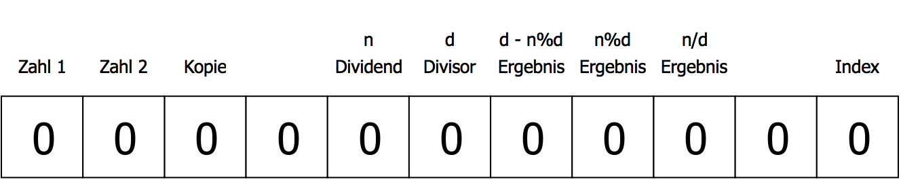
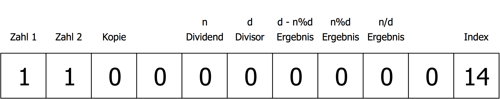
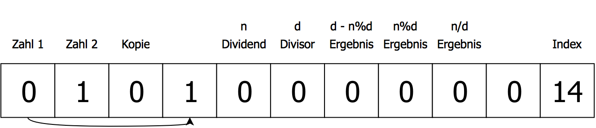
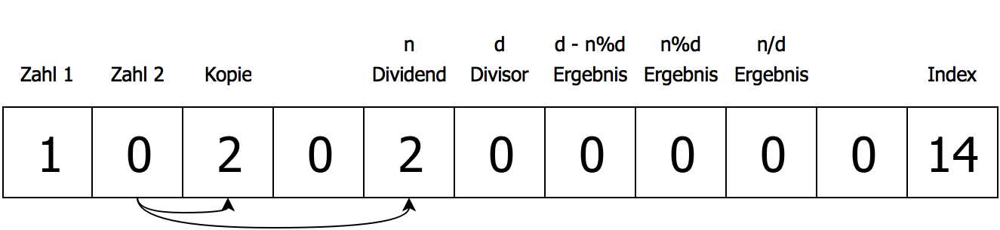
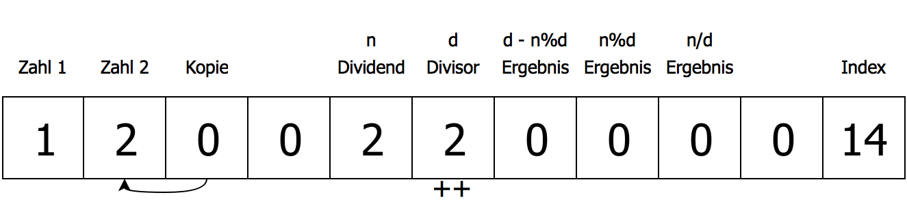
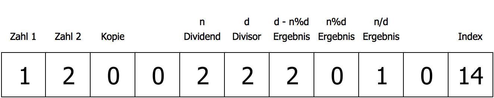

#Kapitel 1
##Was sind esoterische Programmiersprachen?
Esoterische Programmiersprachen sind Programmiersprachen, die nicht zur Verwendung für kommerzielle Software entwickelt worden sind, sondern um mit unkonventionellem Sprachdesign zu experimentieren oder als eine "Witz-Sprache". Esoterische Programmiersprachen werden von kleinen Online-Communities entwickelt und verwendet. Mit esoterischen Programmiersprachen werden zum Beispiel mathematische Probleme gelöst, oder für minimalistische Spiele verwendet. Die meißten esoterischen Programmiersprachen können in fünf verschiedene Kategorien eingeteilt werden.

###Minimalismus
Esoterische Programmiersprachen, die aus den wenigsten möglichen Befehlen bestehen. Eine minimalistische Sprache, die Turing-Complete ist, wird "Turing-Tarpit" genannt. Eine Turing-Complete Programmiersprache muss die selben Rechnung wie eine Turing Maschine berechnen können.
Beispiele: Brainfuck, Whitespace, OISC

###Neues Konzept
Sprachen, die alternative Wege des Sprachdesigns erforschen.
Beispiele: Befunge, Unlamda

###Bizarrheit
Das Ziel dieser Sprachen ist es, bizarr, anders, oder schwer zu verwenden zu sein.
Beispiele: INTERCAL, MALBOLGE

###Thematik
Sprachen, die zu einem bestimmten Thema entwickelt worden sind.
Beispiele: Shakespeare, Chef, Magicard!

###Witzsprache
Eine Sprache, die keinen besonderen Zweck hat, sondern nur als Witz entwickelt worden ist.
Beispiele: l33t, HQ9+

##Ausgewählte Sprachen
###INTERCAL
INTERCAL wurde im Jahr 1972 entwickelt, und ist die erste esoterische Programiersprach. INTERCAL steht für *Compiler Language With No Pronounceable Acronym*. Das Ziel der Sprache ist es, so wenige Ähnlichkeiten mit anderen normalen Programmiersprachen zu haben. Ein INTERCAL Program besteht aus einer Liste von Befehlen.
```python
1:  DO ,1 <- #13
2:  PLEASE DO ,1 SUB #1 <- #238
3:  DO ,1 SUB #2 <- #108
4:  DO ,1 SUB #3 <- #112
5:  DO ,1 SUB #4 <- #0
6:  DO ,1 SUB #5 <- #64
7:  DO ,1 SUB #6 <- #194
8:  DO ,1 SUB #7 <- #48
9:  PLEASE DO ,1 SUB #8 <- #22
10: DO ,1 SUB #9 <- #248
11: DO ,1 SUB #10 <- #168
12: DO ,1 SUB #11 <- #24
13: DO ,1 SUB #12 <- #16
14: DO ,1 SUB #13 <- #162
15: PLEASE READ OUT ,1
16: PLEASE GIVE UP
```
Einer der größten Unterschiede zu normalen Programmiersprachen ist in diesem "Hello World" Beispiel sichtbar. Der Befehl PLEASE wird verwendet, um die Höflichkeit des Programmierers zu testen. Falls weniger als 1/3 der Befehle mit PLEASE beginnen, läuft das Programm nicht.

###BrainFuck
BrainFuck ist wahrscheinlich die bekannteste esoterische Programmiersprache. Ein BrainFuck Programm manipuliert einen Array (auch Memory"" Tape genannt), mithilfe von 8 Befehlen.


|Befehl  | Beschreibung |
|--------|--------------|
|   >    | Bewegt den Pointer nach rechts |
|   <    | Bewegt den Pointer nach links  |
|   +    | Erhöht den Wert an dem Pointer |
|   -    | Verringert den Wert an dem Pointer |
|   .    | Druckt den Wert an dem Pointer |
|   ,    | Speichert einen eingegebenen Wert and dem Pointer |
|   [    | Springt zum passenden ] im Programm, falls der Wert an dem Pointer 0 ist |
|   ]    | Springt zum passenden [ im Programm, falls der Wert an dem Pointer nicht 0 ist |


```brainfuck
>>++++<---
```


In der originalen Implementation des BrainFuck Interpreters und den meißten folgenden repräsentiert ein Wert ein ASCII Zeichen. Wird ein Wert gedruckt, wird nicht sein Zahlenwert, sondern ein ASCII Zeichen ausgegeben. Dieses Programm druckt so die Worte "Hello World!".

```brainfuck
1:  ++++++++
2:  [
3:  >++++
4:  [
5:  >++>+++>+++>+
6:  <<<<-
7:  ]
8:  >+>+>->>+
9:  [
10: <
11: ]
12: <-
13: ]
14: >>.>---.+++++++..+++.>>.
15: <-.<.+++.
16: ------.
17: --------.
18: >>+.>++.
```

###ArnoldC
Arnold C ist eine Programmiersprache, die aus Arnold Schwarzenegger Einzeilern besteht.

```
IT'S SHOWTIME
TALK TO THE HAND "hello world"
YOU HAVE BEEN TERMINATED
```
"IT'S SHOWTIME" und "YOU HAVE BEEN TERMINATED" signalisieren den Anfang bzw. das Ende eines ArnoldC Programms, und "TALK TO THE HAND" druckt einen Wert. Weitere Befehle:

| Befehl                          | Bedeutung   |
|---------------------------------|-------------|
| NO PROBLEMO                     | True        |
| I LIED                          | False       |
| BECAUSE I'M GOING TO SAY PLEASE | If          |
| BULLSHIT                        | Else        |
| YOU HAVE NO RESPECT FOR LOGIC   | Endif       |
| YOU ARE NOT YOU YOU ARE ME      | Ist gleich  |
| DO IT NOW                       | Methodenruf |

###Magicard!
Programme in Magicard! sind in Form einer Anleitung für einen Kartentrick geschrieben.

##Werkzeuge zum Arbeiten mit Brainfuck
###Interpreter
Es gibt viele verschiedene Interpreter, die in allen möglichen programmiersprachen geschrieben wurden, wie zum Besipiel JavaScript, C, Haxe, und auch BrainFuck selbst. Um ein Project Euler Problem zu lösen, habe ich einen Interpreter in Python geschrieben, mit einer leichten Abwandlung von normalen Interpretern. Um das Lösen des Problems zu ermöglichen, behandelt mein Interpreter Werte als Zahlen und druckt ihre Zahlenwerte, anstatt ihrer entsprechenden ASCII Zeichen.

```python
code = ">++.--."
ptr = 0
arr = [0] * 512
bracMap = [0] * 512
breakTimer = 10

i = 0

def makeBracMap():
    for i in range(0,len(code)):
        char = code[i]
        if char == "[":
            x = 1
            c = i
            while(x != 0):
                c+=1
                if code[c] == "]":
                    x-=1

                if code[c] == "[":
                    x+=1
            bracMap[i] = c;
            bracMap[c] = i;


makeBracMap();

while i < len(code):
    char = code[i]
    if char == ">":
        if ptr < 127:
            ptr+=1

    if char == "<":
        if ptr > 0:
            ptr-=1

    if char == "+":
        arr[ptr]+=1

    if char == "-":
        arr[ptr]-=1

    if char == "[" and arr[ptr] == 0:
        i = bracMap[i]

    if char == "]" and arr[ptr] != 0:
        i = bracMap[i]

    if char == ".":
        print(arr[ptr])

    i+=1

    if char == ":":
        breakTimer -= 1
        print(arr[ptr])
        if breakTimer <= 0:
            i = len(code)

    if char == ";":
        breakTimer -= 1
        if breakTimer <= 0:
            i = len(code)

    if char == "@":
        print(ptr)
```

Bei einer so simplistischen esoterischen Sprache muss ein Interpreter nicht sehr kompliziert sein, da er einfach der Reihe nach einfache Befehle ausführen muss. Der komplexeste Aspekt von Brainfuck sind "*[*" und "*]*", also Schleifen, da der Interpreter wissen muss, zu welcher Klammer er zurückspringen muss.

#Code Golf und Project Euler
Code Golf ist eine Art Wettbewerb, bei dem es das Ziel ist, einen bestimmten Vorgang so einfach und schnell wie möglich in einer Programmiersprache umzusetzen. Der Name "Code Golf" bezieht sich darauf, das das Programm mit den wenigsten Buchstaben bzw. Tastenschlägen gewinnt.

###*"Playing Perl golf (fewest (key)strokes wins![sic]) with people who have lots of experience is fine, but it's not going to help much for people who are still trying to get the hang of it."*
(https://groups.google.com/forum/#!msg/comp.lang.perl.misc/zYRU5D2IyuI/II0sSTTEl3sJ)
##Code Golf

##Über Project Euler
Projekt Euler bzw. Project Euler is eine Reihe von mathematischen und informatischen Herausforderungen. Um eine Herausforderung zu lösen werden fortgeschrittene mathematische Kenntnisse benötigt. Weiters werden Programmierkenntnisse unter Beweis gestellt. Speziell bei esoterischen Programmiersprachen existiert die zusätzliche Herausforderung, ein Problem mit den Limitationen der Sprache zu lösen.

###*"Project Euler exists to encourage, challenge, and develop the skills and enjoyment of anyone with an interest in the fascinating world of mathematics."*
(https://projecteuler.net/)

##Problem Nummer 2
Die zweite in den *Project Euler* Archiven gelistete Herausforderung ist das Aufsuchen aller geraden Fibonacci-Zahlen die kleiner als 4 Millionen sind.


##Das Programm
```brainfuck
1:  +>+<>>>>>>>>>>++++++++++++++<<<<<<<<<<
2:  [<<<<<<<<<<
3:  [>>+<<-]
4:  >>[<+<+>>-]<
5:  [>+>>+<<<-]
6:  >[<+>-]>>>[-]++<
7:  [->-[>+>>]>[+[-<+>]>+>>]<<<<<]>>-[<<<<<.>>>>>+][-]<[-]<<<<
8:  [>+<-]
9:  >[<+<+>>-]<<<
10: [>>+>>+<<<<-]
11: >>[<<+>>-]>>>[-]++<
12: [->-[>+>>]>[+[-<+>]>+>>]<<<<<]>>-[<<<<<<.>>>>>>+][-]<[-]<<<<<
10: >>>>>>>>>>-]
```

###Datenstrukutur
Bei "größeren" Programmen in Brainfuck empfiehlt es sich, das Memoryarray klar zu strukturieren und einzuteilen, welche Bedeutung Zellen haben werden. Dabei kann die Bedeutung bestimmter Zellen sich während des Ablaufs des Programms ändern.
####Benötigte Zellen
Zur Berechnung der Fibonacci Zahlen werden drei Zellen benötigt. Die ersten zwei Zellen werden zum Speichern der Fibonacci Zahlen verwendet, die immer gegenseitig addiert werden. Eine dritte Zelle wird als Zwischenspeicher für die Zahl verwendet, die zu der anderen addiert werden soll.
Um festzustellen ob die Zahl gerade ist, wird der DivMod-Algorithmus verwendet. Dieser Algorithmus wird benötigt, um in BrainFuck den Modulo bzw. die Division von 2 Zahlen zu berechnen.
```brainfuck
[->+>-[>+>>]>[+[-<+>]>+>>]<<<<<<]
```
Für die berechnung des Modulos werden 5 Zellen benötigt. Die Zelle n beinhaltet die Zahl die dividiert werden soll, also die gerade berechnete Fibonaccizahl. In der Zelle d wird der Divisor gespeichert. Um zu testen, ob eine Zahl gerade ist, wird sie mit 2 dividiert und der Rest der Division getestet. Der Algorithmus speichert die ERgebnisse der Berechnungen in den nächsten 3 Zellen.



###Erklärung

```brainfuck
1: +>+<>>>>>>>>>>++++++++++++++<<<<<<<<<<
```
In der ersten Zeile des Programms werden bestimmten Zellen im Array Werte zugewiesen. Die Zellen "Zahl 1" und "Zahl 2" werden jeweils auf 1 gesetzt, um die Fibonacci Reihe zu beginnen. Die Zelle "Index" bekommt den Wert 14. Dies lässt die Schleife im Programm 14 Mal laufen, die benötigte Anzahl um alle gesuchten Zahlen zu errechnen.



```brainfuck
3: [>>+<<-]
4: >>[<+<+>>-]<
```
Um einen Wert in BrainFuck zu bewegen wird normalerweise eine einfache Schleife verwendet ```[>+<-]```. Diese Schleife subtrahiert 1 von einer Zelle und addiert 1 zu einer Anderen, bis der Wert von der ersten Zelle 0 ist. Um einen Wert zu kopieren, d.h. ihn zu verdoppeln, muss er zuerst in eine andere Zelle bewegt werden, und dann zurück auf seine ursprüngliche Zelle sowie die Zellen, auf welche der Wert kopiert werden soll. Dieser Vorgang passiert in den Zeilen 3 und 4 meines Programms. Dies hat den Effekt, das der Wert von Zahl 1 zu Zahl 2 addiert wird, um die Fibonacci folge zu bilden.



```brainfuck
5: [>+>>+<<<-]
6: >[<+>-]>>>[-]++<
```
Der selbe Algorithmus wird in Zeile 5 und 6 verwendet. Hier wird das Ergebnis der Addition aus Zeilen 3 und 4, also die nächste Zahl in der Fibonacci Reihe, in die Zelle n kopiert. In Zeile 6 wird auch der Wert der Zelle d auf 2 gesetzt.


```brainfuck
7: [->-[>+>>]>[+[-<+>]>+>>]<<<<<]>>-[<<<<<.>>>>>+][-]<[-]<<<<
```
In der Fragestellung wird nach Fibonaccizahlen gefragt die gerade sind. Um herauszufinden ob eine Zahl gerade ist, wird der Rest der Division mit 2 berechnet. Ist dieser 1, ist die Zahl ungerade, bei 0 ist die Zahl gerade. Um dies in BrainFuck umzusetzen, wird der *divmod Algorithmus* angewandt. Dieser Vorgang berechnet Modulo, und Division der Zellen n und d, und speichert die Ergebnisse der unterschiedlichen Rechnungen in den 3 folgenden Zellen. Falls die Zahl gerade ist, wird sie vom Programm ausgegeben.

Der Zweite Teil der Schleife wiederholt das selbe Prinzip, mit dem unterschied das Zahl 2 zu Zahl 1 addiert wird.

Dieser Vorgang wird 14 mal wiederholt, bis zur Fibonacci Zahl 3.524.578, der letzten geraden Fibonacci Zahl unter 4.000.000.

#BFJoust

##Das Spiel
BFJoust ist ein von Kerim Aydin entworfenes Spiel, welches auf "Capture the Flag"-ähnlichen Regeln basiert. Die Regeln wurden zum ersten Mal am 6. Jänner 2009 veröffentlicht. Das Spiel wird von zwei Bots (geschrieben in BrainFuck) gespielt, die auf einem geteilten Array versuchen, die gengerische Flag^1^ von 127 auf 0 zu setzten. Um Bots lesbarer zu machen wird eine Art Preprocessor verwendet, der die Zeichen `()*{}%` verwendet. `(>+)*5` wird zum Beispiel zu `>+>+>+>+>+` verarbeitet.

##Regeln
Zu Beginn des Spiels wird das "Schlachtfeld" generiert. Es besteht aus einem Array mit einer zufällignen Länge zwischen 10 und 30 Elementen. Jedes Element ist ein 8 bit integer, und kann die Werte -127 bis 127 annehmen. Bei Spielstart werden die Flags auf 127 gesetzt, die restlichen Elemente auf 0. Ziel des Spiels bzw. der Bots ist es, die gegnerische Flag auf 0 zu reduzieren. Der Bot gewinnt, falls die gegnerische Flag für 2 Züge zu 0 gesetzt ist. Bewegt sich ein Bot über die gegnerische Flagge hinweg, verlässt also den Array, führt er keine weiteren Befehle mehr aus und wartet das Ende des Spiels ab. Falls ein Element mit dem Wert -127 reduziert wird, nimmt es den Wert 127 an, ein Element mit dem Wert 127 nimmt beim inkrementieren den Wert -127 an. Die meisten Spielprogramme lassen die beiden Bots auf jeder möglichen Spielfeldlänge (10-30) einmal normal und einmal mit umgedrehter Polarität (d.h. + und - im Programm werden jeweils durch das Andere ersetzt) spielen und ermitteln so den insgesamt besseren Bot.

##Strategien
Obwohl das Spiel aus einfachen Regeln aufgebaut ist, haben sich mit der Zeit viele verschiedene Stategien entwickelt.

###Decoy
Ein Decoy ist ein Element, welches so verändert wird, dass der gegnerische Bot es falsch als Flag erkennt und auf 0 setzt. Durch diese Strategie wird der Bot verzögert und von der Flag ferngehalten.

###Rush
Ein Rush Bot versucht so schnell wie möglich zu der gegnerischen Flag zu kommen, ohne Decoys zu setzten.
Einer der einfachsten Rush Bots ist `(>)*9([-].>)*21`. Dieser Bot überspringt die ersten 9 Elemente^2^, und setzt dann der Reihe nach jedes Element auf 0.

###Poke
Das Ziel eines Poke Bots ist es, die Position des Gegners herauszufinden und Decoys direkt vor ihm aufzubauen. `(>[])*30` bewegt den Bot vorwärts bis er sich auf einem Element mit dem Wert ¬0 befindet und führt dann Code in den eckigen Klammern aus. Ein einfacher Poke Bot würde anfangen, direkt vor dem Gegner Decoys aufzubauen.

###Tripwire
Eine Tripwire ist eine Zelle die auf einen niedrigen Wert gesetzt ist. Der Bot der die Zelle als Tripwire verwendet wartet bis sie der andere Bot auf 0 gesetzt hat, und fährt erst dann mit seinem Programm fort. `+[]` ist eine einfache Tripwire. Eine Element wird auf 1 gesetzt, und der Bot wartet mit einer leeren Schleife darauf, das der Wert der Zelle 0 wird.

###Clear
Um zu gewinnen muss die gegnerische Flag auf 0 gesetzt werden. Eine einfache Methode ist `[-]`. Dieser Code verringert eine Flag bis sie den Wert 0 annimmt. `(>)*9([-]>)*21` ist ein kompletter Clear Bot. `[-]` ist ein "two-cycle" Clear, da er für eine Reduktion 2 Schritte braucht. Ein schnellerer "one-cycle" Clear wäre `(-)*128`.

###Wiggle Clear
Wiggle Clear ist eine der komplexesten Clear Methoden. Um Decoys zu verringern können sie entweder reduziert oder inkrementiert werden. Bei Decoys ist immer eine dieser Methoden schneller, z.B. ist ein Decoy mit dem Wert -3  beim Inkrementieren in drei Schritten auf dem Wert 0, wird das Decoy reduziert dauert der selbe Vorgang 252 Schritte. Um zu verhindern, dass Decoys in die "falsche Richtung" verändert werden, gibt es Wiggle Clear. `([-{ ([+{[-]}])%8}])%4>` ist ein einfacher Wiggle Clear. Der Preprocessor verarbeitet diesen Code zu `[-[-[-[-[+[+[+[+[+[+[+[+[-]]]]]]]]]]]]]>`. Bei diesem Wiggle Clear wird der Decoy zuerst um 4 verringert und anschließen um 8 erhöht. Nimmt das Element dabei 0 an bewegt sich der Bot zum nächsten Element, ansonsten wird es ohne spezielle Methode weiter reduziert. Elemente mit Werten zwischen -4 und 4 werden nach dieser Methode sehr schnell auf 0 gesetzt.

##Mein Bot
```brainfuck
1: (>)*8+(<)*7
2: (
3: (-)*13>
4: (+)*13>
5: )*4
6: (([-{([+{[-]}])%8}])%4>)*21
```

##Verwendete Strategien
Mein Bot verwendet eine Kombination von unterschiedlichen Strategien
###Decoy
In der ersten Zeilen bewegt sich der Bot 8 Elemente auf den Gegner zu, setzt ein Decoy und bewegt sich wieder auf das Element vor der eigenen Flag zurück. Dieses Decoy ist eine einfache Verteidigung gegen Poke Strategien, da der Gegner die Position des Bots viel näher einschätzt als er eigentlich ist.

In den Zeilen 2 bis 5 bewegt sich der Bot 8 Elemente Vorwärts und setzt weitere Decoys mit dem Wert 13 bzw. -13.

###Rush
Nachdem die Decoys gesetzt worden sind beginnt der Bot mit einem Rush, und reduziert jedes Element auf 0. Im Idealfall wird der Gegnerische Bot durch die gesetzten Decoys lange genug aufgehalten, und erreicht nicht rechtzeitig die Flag.

###Wiggle Clear
Um den Rush zu beschleunigen werden Elemente mit dem Wiggle Clear Algorithmus reduziert. Dieser Vorgang wird wiederholt, bis die Gegnerische Flag auf 0 gesetzt worden ist.

###Ergebnisse gegen andere Bots
Die meisten Bots werden nach dem Schema [Nickname des Programmierers]_[Bot Name]. Mein Bot ist `helyx_FightAndFlight` benannt. Die Website http://zem.fi/bfjoust/ bietet ein WebApp an, mit dem BFJoust Bots getestet werden können. Die Ergebnisse von Spielen gegen 5 andere Bots sind für meinen simplistischen Bot überraschend gut ausgefallen.

####Moop_Alternator
```brainfuck
(>+>-)*4>+(>[-][.])*21
```
Alternator ist ein Bot der annimmt, das der gengerische Bot Zellen entweder durch addieren oder subtrahieren auf 0 setzt. Falls Zellen abwechselnd auf 1 und -1 gesetzt sind, braucht eine Bot mit einer einfachen Clear Methode durchschnittlich 128 Züge pro Zelle. Da mein Bot Wiggle Clear verwendet werden die Decoys von diesem Bot aber schnell beseitigt.

>35/42 Runden gewonnen

####ccarton_AnybodyThere?
```brainfuck
1:  >>>+<(+)*5<(-)*5>>
2:  [
3:  (>[([(+)*10[-]]>)*29])*4
4:  +
5:  <<<<
6:  [
7:  >>>
8:  (+)*5<(-)*5
9:  <<[-]
10:]
11: >>>>
12: ]
13: ([-[(+)*10[-]]]>)*29
```
Diser Bot setzt zuerst in den ersten 2 Zellen kleine Decoys, und verwendet dann die dritte Zelle als Tripwire. Falls die Tripwire nicht ausgelöst wurde, bewegt sich der Bot 4 Felder nach vor und setzt weiter Decoys. Dieser Vorgang wiederholt sich, und wird nach jeder Iteration um 4 Zellen vorverlegt. Sobald ein Anzeichen des gengerischen Bots gefunden wurde (entweder ein eigenes Decoy das auf 0 gesetzt wurde, oder ein Decoy vom Gegner), beginnt der Bot mit einem einfachen Rush. Dieser Bot setzt sehr viele Decoys, die erst auf längeren Memorytapes wirklich nützlich sind. Mein Bot verliert erst ab einer Länge von 25 Zellen konsistent gegen den Bot, und gewinnt deswegen das Spiel.

> 31/42 Runden gewonnen

####weston_MickyV4
```brainfuck
++>------>->---<<<------------->------>->
---->------------->>--->------<----------
------<------<-<<--<------------->-------
-<-->------>------->----------->---------
----->-------->------->----------------[>
[--[-[+]]]>[--[+]]-]-------[>[--[-[+]]]>[
--[+]]-]<--<------>------->--------------
--[>[--[-[+]]]>[--[+]]-]<--<-------------
--------->------>->-<-----
```

MickyV4 wurde mithilfe eines genetischen Algorithmus entwickelt. Bei einem genetischen Algorithmus werden Prinzipien aus der Evolution auf Programme angewandt, und so durch Mutationen von selbst weiterentwikelt. Bei diesem Algorithmus wurde ein zufällig generierter Bot, also eine Reihe von zufälligen Befehlen, gegen 60 andere Bots getestet. Nach einem Durchgang ("Generation") wird das Programm zufällig verändert("Mutationen"). Mutationen, die den Bot verbessern werden behalten, schlecte Mutationen verworfen. Dieser Bot ist das Ergebnis von 1400 Generation. Da er zufällig generiert wurde, besitzt er keine wirkliche Strtategie und ist schwer zu verstehen. Von den ersten 21 Runden konnte mein Bot nur eine gewinnen. Bei umgedrehter Polarität werden jedoch die Decoys von MickyV4 nutzlos, da alle positive Werte haben, und von meinem Bot sehr schnell beseitigt werden. Deswegen gewann mein Bot ab der 21. Runde jede Runde.

> 22 / 42 Runden gewonnen

####Sylwester_BurlyBalderV3

```brainfuck
1:  >((-)*18>)*2
2:  (->)*6
3:  [
4:    +[+[+[+[+[+[+[+[+[+[+[+[+[+[+[+[+[+[
5:    (-)*18
6:    -[-[-[-[-[-[-[-[-[-[-[-[-[-[-[-[-[-[
7:      (-)*107
8:      [-.]
9:    ]]]]]]]]]]]]]]]]]]
10:   ]]]]]]]]]]]]]]]]]]
11: ]
12: +
13: ([>
14:   [
15:     +[+[+[+[+[+[+[+[+[+[+[+[+[+[+[+[+[+[
16:     (-)*18
17:     -[-[-[-[-[-[-[-[-[-[-[-[-[-[-[-[-[-[
18:       (-)*107
19:       [-.]
20:     ]]]]]]]]]]]]]]]]]]
21:     ]]]]]]]]]]]]]]]]]]
22:   ]
23:   --
24: ]
25: -
26: )*5
```

BurlyBalder ist in zwei Pahsen aufgeteilt. Am Anfang des Spiels setzt er zwei Decoys nahe an seiner Flag, und fängt dann an den Gegner zu rushen. Die erste Schleife beinhaltet einen Clear Algorithmus für den Fall dass das Memory Tape 10 Zellen lang ist. Der restliche Code ist ein modifizierter Wiggle Clear, der nach jedem Decoy das gecleared wurde ein eigenes Decoy mit dem Wert -2 hinterlässt

>10/42 Runden gewonnen

---
1: Anfang bzw. Ende des Arrays
2: Die ersten 9 Elemente können nie die gegnerische Flag enthalten, und werden daher von vielen Bots übersprungen.


[Esoterische Programmierprachen](http://esolangs.org/wiki/Esoteric_programming_language)
[INTERCAL](http://esolangs.org/wiki/INTERCAL)
[BrainFuck](http://esolangs.org/wiki/BrainFuck)
[ArnoldC](https://github.com/lhartikk/ArnoldC)
[BFJoust Regeln](https://esolangs.org/wiki/BF_Joust)
[BFJoust Strategien](https://esolangs.org/wiki/BF_Joust_strategies)
[BFJoust Webapp](http://zem.fi/bfjoust/)
[BFJoust Visualisierung](http://codu.org/eso/bfjoust/egojsout/)
[BFJoust Bots](http://codegolf.stackexchange.com/questions/36645/brainfedbotsforbattling-a-brainf-tournament)
[Original BFJoust Regeln](http://agora-notary.wikidot.com/deleted:brainfuck-joust)

[Project Euler](https://projecteuler.net/)