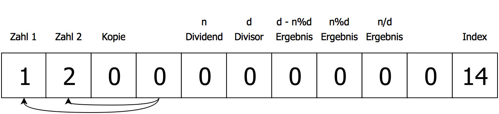

#Kapitel 1
##Was sind esoterische Programmiersprachen?
Esoterische Programmiersprachen sind Programmiersprachen, die nicht zur Verwendung für kommerzielle Software entwickelt worden sind, sondern um mit unkonventionellem Sprachdesign zu experimentieren oder als eine "Witz-Sprache". Esoterische Programmiersprachen werden von kleinen Online-Communities entwickelt und verwendet. Mit esoterischen Programmiersprachen werden zum Beispiel mathematische Probleme gelöst, oder für minimalistische Spiele verwendet. Die meißten esoterischen Programmiersprachen können in fünf verschiedene Kategorien eingeteilt werden.

###Minimalismus
Esoterische Programmiersprachen, die aus den wenigsten möglichen Befehlen bestehen. Eine minimalistische Sprache, die Turing-Complete <!--TODO: Turing-Complete erklären--> ist, wird "Turing-Tarpit" genannt.
Beispiele: Brainfuck, Whitespace, OISC

###Neues Konzept
Sprachen, die alternative wege des Sprachdesigns erforschen.
Beispiele: Befunge, Unlamda

###Bizarrheit
Das Ziel dieser Sprachen ist es, bizarr, anders, oder schwer zu verwenden zu sein.
Beispiele: INTERCAL, MALBOLGE

###Thematik
Sprachen, die zu einem bestimmten Thema entwickelt worden sind.
Beispiele: Shakespeare, Chef, Magicard!

###Witzsprache
Eine Sprache, die keinen besonderen Zweck hat, sondern nur als Witz entwickelt worden ist.
Beispiele: l33t, HQ9+

##Ausgewählte Sprachen
###INTERCAL
INTERCAL wurde im Jahr 1972 entwickelt, und ist die erste esoterische Programiersprach. INTERCAL steht für *Compiler Language With No Pronounceable Acronym*. Das Ziel der Sprache ist es, so wenige Ähnlichkeiten mit anderen normalen Programmiersprachen zu haben. Ein INTERCAL Program besteht aus einer Liste von Befehlen.
```
1:  DO ,1 <- #13
2:  PLEASE DO ,1 SUB #1 <- #238
3:  DO ,1 SUB #2 <- #108
4:  DO ,1 SUB #3 <- #112
5:  DO ,1 SUB #4 <- #0
6:  DO ,1 SUB #5 <- #64
7:  DO ,1 SUB #6 <- #194
8:  DO ,1 SUB #7 <- #48
9:  PLEASE DO ,1 SUB #8 <- #22
10: DO ,1 SUB #9 <- #248
11: DO ,1 SUB #10 <- #168
12: DO ,1 SUB #11 <- #24
13: DO ,1 SUB #12 <- #16
14: DO ,1 SUB #13 <- #162
15: PLEASE READ OUT ,1
16: PLEASE GIVE UP
```
Einer der Wichtigsten Unterschiede zu normalen Programmiersprachen ist in diesem "Hello World" Beispiel sichtbar. Der Befehl PLEASE wird verwendet, um die Höflichkeit des Programmierers zu testen. Falls weniger als 1/3 der Befehle mit PLEASE beginnen, läuft das Programm nicht.

###BrainFuck
BrainFuck ist wahrscheinlich die bekannteste esoterische Programmiersprache. Ein BrainFuck Programm manipuliert einen Array (auch Memory"" Tape genannt), mithilfe von 8 Befehlen.


|Befehl  | Beschreibung |
|--------|--------------|
|   >    | Bewegt den Pointer nach rechts |
|   <    | Bewegt den Pointer nach links  |
|   +    | Erhöht den Wert an dem Pointer |
|   -    | Verringert den Wert an dem Pointer |
|   .    | Druckt den Wert an dem Pointer |
|   ,    | Speichert einen eingegebenen Wert and dem Pointer |
|   [    | Springt zum passenden ] im Programm, falls der Wert an dem Pointer 0 ist |
|   ]    | Springt zum passenden [ im Programm, falls der Wert an dem Pointer nicht 0 ist |


```
>>++++<---
```


```
1:  ++++++++
2:  [
3:  >++++
4:  [
5:  >++>+++>+++>+
6:  <<<<-
7:  ]
8:  >+>+>->>+
9:  [
10: <
11: ]
12: <-
13: ]
14: >>.>---.+++++++..+++.>>.
15: <-.<.+++.
16: ------.
17: --------.
18: >>+.>++.
```


###ArnoldC
Arnold C ist eine Programmiersprache, die aus Arnold Schwarzenegger Einzeilern besteht.

```
IT'S SHOWTIME
TALK TO THE HAND "hello world"
YOU HAVE BEEN TERMINATED
```
"IT'S SHOWTIME" und "YOU HAVE BEEN TERMINATED" signalisieren den Anfang bzw. das Ende eines ArnoldC Programms, und "TALK TO THE HAND" druckt einen Wert. Weitere Befehle:

| Befehl                          | Bedeutung   |
|---------------------------------|-------------|
| NO PROBLEMO                     | True        |
| I LIED                          | False       |
| BECAUSE I'M GOING TO SAY PLEASE | If          |
| BULLSHIT                        | Else        |
| YOU HAVE NO RESPECT FOR LOGIC   | Endif       |
| YOU ARE NOT YOU YOU ARE ME      | Equal To    |
| DO IT NOW                       | Call Method |

###Magicard!
Programme in Magicard! sind in Form von einer Anleitung für einen Kartentrick geschrieben.

#BFJoust

##Das Spiel
BFJoust ist ein von Kerim Aydin entworfenes Spiel, welches auf "Capture the Flag"-ähnlichen Regeln basiert. Die Regeln wurden zum ersten Mal am 6. Jänner 2009 veröffentlicht. Das Spiel wird von zwei Bots (geschrieben in BrainFuck) gespielt, die auf einem geteilten Array versuchen, die gengerische Flag^1^ von 127 auf 0 zu setzten. Um Bots lesbarer zu machen wird eine Art Preprocessor verwendet, der die Zeichen `()*{}%` verwendet. `(>+)*5` wird zum Beispiel zu `>+>+>+>+>+` verarbeitet.

##Regeln
Zu Beginn des Spiels wird das "Schlachtfeld" generiert. Es besteht aus einem Array mit einer zufällignen Länge zwischen 10 und 30 Elementen. Jedes Element ist ein 8 bit integer, und kann die Werte -127 bis 127 annehmen. Bei Spielstart werden die Flags auf 127 gesetzt, die restlichen Elemente auf 0. Ziel des Spiels bzw. der Bots ist es, die gegnerische Flag auf 0 zu reduzieren. Der Bot gewinnt, falls die gegnerische Flag für 2 Züge zu 0 gesetzt ist. Bewegt sich ein Bot über die gegnerische Flagge hinweg, verlässt also den Array, führt er keine weiteren Befehle mehr aus und wartet das Ende des Spiels ab. Falls ein Element mit dem Wert -127 reduziert wird, nimmt es den Wert 127 an, ein Element mit dem Wert 127 nimmt beim inkrementieren den Wert -127 an. Die meisten Spielprogramme lassen die beiden Bots auf jeder möglichen Spielfeldlänge (10-30) einmal Spielen und ermitteln so den insgesamt besseren Bot.

##Strategien
Obwohl das Spiel aus einfachen Regeln besteht gibt es sehr viele unterschiedliche Strategien.

###Decoy
Ein Decoy ist ein Element, welches so verändert wird, dass der gegnerische Bot es falsch als Flag erkennt und auf 0 setzt. Durch diese Strategie wird der Bot verzögert und von der Flag ferngehalten.

###Rush
Ein Rush Bot versucht so schnell wie möglich zu der gegnerischen Flag zu kommen, ohne Decoys zu setzten.
Einer der einfachsten Rush Bots ist `(>)*9([-].>)*21`. Dieser Bot überspringt die ersten 9 Elemente^2^, und setzt dann der Reihe nach jedes Element auf 0.

###Poke
Das Ziel eines Poke Bots ist es, die Position des Gegners herauszufinden und Decoys direkt vor ihm aufzubauen. `(>[])*30` bewegt den Bot vorwärts bis er sich auf einem Element mit dem Wert ¬0 befindet und führt dann Code in den eckigen Klammern aus. Ein einfacher Poke Bot würde anfangen, direkt vor dem Gegner Decoys aufzubauen.

###Clear
Um zu gewinnen muss die gegnerische Flag auf 0 gesetzt werden. Eine einfache Methode ist `[-]`. Dieser Code verringert eine Flag bis sie den Wert 0 annimmt. `(>)*9([-]>)*21` ist ein kompletter Clear Bot. `[-]` ist ein "two-cycle" Clear, da er für eine Reduktion 2 Schritte braucht. Ein schnellerer "one-cycle" Clear wäre `(-)*128`.

###Wiggle Clear
Wiggle Clear ist eine der komplexesten Clear Methoden. Um Decoys zu verringern können sie entweder reduziert oder inkrementiert werden. Bei Decoys ist immer eine dieser Methoden schneller, z.B. ist ein Decoy mit dem Wert -3  beim Inkrementieren in drei Schritten auf dem Wert 0, wird das Decoy reduziert dauert der selbe Vorgang 252 Schritte. Um zu verhindern, dass Decoys in die "falsche Richtung" verändert werden, gibt es Wiggle Clear. `([-{ ([+{[-]}])%8}])%4>` ist ein einfacher Wiggle Clear. Der Preprocessor verarbeitet diesen Code zu `[-[-[-[-[+[+[+[+[+[+[+[+[-]]]]]]]]]]]]]>`. Bei diesem Wiggle Clear wird der Decoy zuerst um 4 verringert und anschließen um 8 erhöht. Nimmt das Element dabei 0 an bewegt sich der Bot zum nächsten Element, ansonsten wird es ohne spezielle Methode weiter reduziert. Elemente mit Werten zwischen -4 und 4 werden nach dieser Methode sehr schnell auf 0 gesetzt.

##Mein Bot
Mein Bot beruht auf einer Kombination unterschiedlicher Strategien.
```
1: (>)*8+(<)*7
2: (
3: (-)*13>
4: (+)*13>
5: )*4
6: (([-{([+{[-]}])%8}])%4>)*21
```

Die erste Zeile des Quellcodes bewegt den Bot 8 Elemente auf den Gegner zu, setzt ein Decoy und bewegt sich wieder auf das Element vor der eigenen Flag zurück. Dieses Decoy ist eine einfache Verteidung gegen Poke Strategien, da der Gegner die Position des Bots viel näher einschätzt als er eigentlich ist.

In den Zeilen 2 bis 5 bewegt sich der Bot 8 Elemente Vorwärts und setzt Decoys mit dem Wert 13 bzw. -13.

Nachdem die Decoys gesetzt worden sind beginnt der Bot mit einem Rush, und reduziert jedes Element auf 0. Um diesen Vorgang zu beschleunigen werden Elemente mit einem Wiggle Clear reduziert, bis die Gegnerische Flag auf 0 gestezt ist.

###Ergebnisse gegen andere Bots
Die meisten Bots werden nach dem Schema [Programmierer Nickname]_[Bot Name]. Mein Bot ist `helÿx_FightAndFlight` benannt.

| Bot Name           | Ergebnis (gewonnene Spiele / Spiele insgesamt)|
|--------------------|------------------------------------------------|
| fizzie_tiny        | 40/42 (Sieg)                                   |
| Deewiant_pendolino | 29/42 (Sieg)                                   |
| quintopia_poke     | 21/42 (Unentschieden)                          |
| guestbot_test      | 17/42 (Besiegt)                                |
| ais523_shudderlock |  4/42 (Besiegt)                                |


#Project Euler

##Über das Projekt
Projekt Euler bzw. Project Euler is eine Reihe von mathematischen und informatischen Herausforderungen. Um eine Herausforderung zu lösen werden fortgeschrittene mathematische Kenntnisse benötigt. Weiters werden Programmierkenntnisse unter Beweis gestellt. Bei *Code Golf* werden Herausforderungen in unterschiedlichen Programmiersprachen möglichst effizient gelöst. Speziell bei esoterischen Programmiersprachen existiert die zusätzliche Herausforderung, ein Problem mit den Limitationen der Sprache zu lösen.

###*"Project Euler exists to encourage, challenge, and develop the skills and enjoyment of anyone with an interest in the fascinating world of mathematics."*
(https://projecteuler.net/)

##Problem Nummer 2
Die zweite in den *Project Euler* Archiven gelistete Herausforderung ist das Aufsuchen aller geraden Fibonacci-Zahlen die kleiner als 4 Millionen sind.


##Das Programm
```
1:  +>+<>>>>>>>>>>++++++++++++++<<<<<<<<<<
2:  [
3:  [>>+<<-]
4:  >>[<+<+>>-]<
5:  [>+>>+<<<-]
6:  >[<+>-]>>>[-]++<
7:  [->-[>+>>]>[+[-<+>]>+>>]<<<<<]>>-[<<<<<.>>>>>+][-]<[-]<<<<
8:  [>+<-]
9:  >[<+<+>>-]<<<
10: [>>+>>+<<<<-]
11: >>[<<+>>-]>>>[-]++<
12: [->-[>+>>]>[+[-<+>]>+>>]<<<<<]>>-[<<<<<<.>>>>>>+][-]<[-]<<<<<
10: >>>>>>>>>>-<<<<<<<<<<]
```

###Datenstrukutur
Bei "größeren" Programmen in Brainfuck empfiehlt es sich, das Memoryarray klar zu strukturieren und einzuteilen, welche Bedeutung Zellen haben werden.


###Erklärung

```
1: +>+<>>>>>>>>>>++++++++++++++<<<<<<<<<<
```
In der ersten Zeile des Programms wird der Memoryarray initiiert. Die Zellen "Zahl 1" und "Zahl 2" werden jeweils auf 1 gesetzt, um die Fibonacci Reihe zu beginnen. Die Zelle "Index" bekommt den Wert 14. Dies lässt die Schleife im Programm 14 Mal laufen, die benötigte Anzahl um alle gesuchten Zahlen zu errechnen.



```
3: [>>+<<-]
4: >>[<+<+>>-]<
```
Um einen Wert in BrainFuck zu kopieren, muss er zuerst in eine andere Zelle bewegt werden. Um die Zahlen zu addieren, wird "Zahl 1" also zuerst in die "Kopie" Zelle kopiert, und dann zurück zu ihrer ursprünglichen Zelle, wobei sie auch zu "Zahl 1" addiert wird.

```
5: [>+>>+<<<-]
```


```
6: >[<+>-]>>>[-]++<
```


```
7: [->-[>+>>]>[+[-<+>]>+>>]<<<<<]>>-[<<<<<.>>>>>+][-]<[-]<<<<
```


---
1: Anfang bzw. Ende des Arrays
2: Die ersten 9 Elemente können nie die gegnerische Flag enthalten, und werden daher von vielen Bots übersprungen.


[Esoterische Programmierprachen](http://esolangs.org/wiki/Esoteric_programming_language)
[INTERCAL](http://esolangs.org/wiki/INTERCAL)
[BrainFuck](http://esolangs.org/wiki/BrainFuck)
[ArnoldC](https://github.com/lhartikk/ArnoldC)
[BFJoust Regeln](https://esolangs.org/wiki/BF_Joust)
[BFJoust Strategien](https://esolangs.org/wiki/BF_Joust_strategies)
[BFJoust Webapp](http://zem.fi/bfjoust/)
[BFJoust Visualisierung](http://codu.org/eso/bfjoust/egojsout/)
[Original BFJoust Regeln](http://agora-notary.wikidot.com/deleted:brainfuck-joust)

[Project Euler](https://projecteuler.net/)