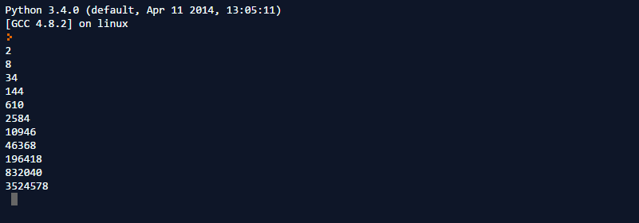
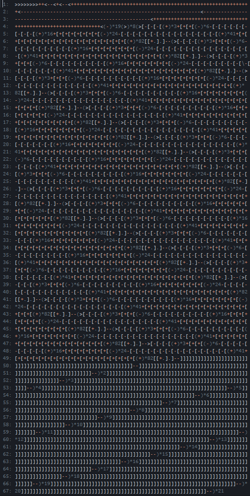

# Kapitel 1
## Was sind esoterische Programmiersprachen?
Esoterische Programmiersprachen sind Programmiersprachen, die nicht zur Verwendung für kommerzielle Software entwickelt worden sind, sondern unter anderem um mit unkonventionellem Sprachdesign zu experimentieren. Einige esoterische Programmiersprachen wurden auch nur aus reinem Humor Esoterische Programmiersprachen werden von verschiedenen Online-Communities entwickelt und verwendet. Mit esoterischen Programmiersprachen werden zum Beispiel mathematische und informatische Herausforderungen gelöst. Bei dem Spiel BrainFuck Joust werden Roboter(**Bots**), programmiert in einer esoterischen Programmiersprache, verwendet, die gegeneinander eine Variante von "Capture the Flag" zu spielen. Die meisten esoterischen Programmiersprachen können in fünf verschiedene Kategorien eingeteilt werden.[^1]

### Minimalismus
Esoterische Programmiersprachen, die aus den wenigsten möglichen Befehlen bestehen. Eine minimalistische Sprache, die Turing-Complete ist, wird "Turing-Tarpit" genannt. Eine Turing-Complete Programmiersprache muss die selben Berechnung wie eine Turing Maschine berechnen können.

#### BrainFuck
BrainFuck ist wahrscheinlich die bekannteste esoterische Programmiersprache. Ein BrainFuck Programm manipuliert einen Array (auch "Memory Tape" genannt). Jedes Element des Arrays besitzt am Anfang des Programmablaufs den Wert 0. Ein Brainfuck Programm kann diesen Array mithilfe von 8 Befehlen modifizieren. Brainfuck ist Turing-Complete, und kann somit jede mathemathische Berechnung durchführen, wenn auch meißt sehr ineffizient.


| Befehl | Beschreibung                                                                     |
|--------|----------------------------------------------------------------------------------|
|   >    | Bewegt den Pointer nach rechts                                                   |
|   <    | Bewegt den Pointer nach links                                                    |
|   +    | Erhöht den Wert an dem Pointer                                                   |
|   -    | Verringert den Wert an dem Pointer                                               |
|   .    | Druckt den Wert an dem Pointer                                                   |
|   ,    | Speichert einen eingegebenen Wert and dem Pointer                                |
|   [    | Springt zum passenden *]* im Programm, falls der Wert an dem Pointer 0 ist       |
|   ]    | Springt zum passenden *[* im Programm, falls der Wert an dem Pointer nicht 0 ist |

Fast alle dieser Befehle können sehr leicht in anderen Programmiersprachen emuliert werden. Aus diesem Grund gibt es sehr viele Interpreter in unterschiedlichen Sprachen gibt. Für mein Project Euler Programm habe ich einen eigenen Interpreter in Python geschrieben. Um das Schreiben von Brainfuck Programmen zu erleichtern, existieren auch Transpiler, die bestimmte Programme aus unterschiedlichen Programmiersprachen wie zum Beispiel C oder Java zu Brainfuck verarbeiten. Da die Befehle von Brainfuck in ihrer Funktionalität begrenzt sind, müssen komplexere Befehle wie *if*, *for*, und *while* zu sehr langen Ketten aus Brainfuck-Befehlen übersetzt werden, um den selben Effekt zu erzielen.

```brainfuck
>>++++<---
```
Dieses einfache BrainFuck Programm modifiziert zwei Zellen des "Memory Tape".


In der originalen Implementation des BrainFuck Interpreters und den meißten folgenden repräsentiert ein Wert ein ASCII Zeichen. Wird ein Wert gedruckt, wird nicht sein Zahlenwert, sondern sein korrespondierendes ASCII Zeichen ausgegeben. Dieses Programm druckt so die Worte "Hello World!".

```brainfuck
1:  ++++++++
2:  [
3:  >++++
4:  [
5:  >++>+++>+++>+
6:  <<<<-
7:  ]
8:  >+>+>->>+
9:  [
10: <
11: ]
12: <-
13: ]
14: >>.>---.+++++++..+++.>>.
15: <-.<.+++.
16: ------.
17: --------.
18: >>+.>++.
```


### Neues Konzept
Programmiersprachen, die alternative Wege des Sprachdesigns erforschen.

#### Befunge
Bei der Programmiersprache Befunge wird das Programm in einem zwei dimensionalen Raum geschrieben, und der Ablauf des Programms wird mit den Befehlen *<>^v* in eine Richtung "gelenkt". Neben diesen Befehlen gibt es eine Vielzahl von Anderen, die unterschiedliche Auswirkungen auf den Ablauf des Programms haben. Mit dem *p* Befehl kann sich ein Befunge Programm sogar selbst verändern, während es abläuft.
```cpp
2>:3g" "-!v\  g30          <
 |!`"O":+1_:.:03p>03g+:"O"`|
 @               ^  p3\" ":<
2 234567890123456789012345678901234567890123456789012345678901234567890123456789
```
Dieses Befunge Programm ist eine Implemententation des Sieb des Eratosthenes, und wird zur Berechnung von Primzahlen verwendet.

Befunge ist Turing-complete, wodurch unter anderem dieser Befunge Interpreter möglich ist, der selbst in Befunge geschrieben ist.

```cpp
028p038p108p018pv
     vp91+56p900<       v_v#!-+1"!":<                 >:"<"-!#v_:"^"-!#v_  v
     >"*"09g:19g\19gg29p p 29g28g  #^_ :" "-!#v_:"v"-#^_    v
     ^p91+g91g81p90+g90g 8 0pg91g90g92$       <    <
                          >:         >38g7p38g1+38p^p811p800<
                        >28g!28p                   ^p810p80-10<         <
                                                   ^p81-10p800         <
                                                   ^p810p801<     _v#!-">":<
                                     ^  -"0":_v#`\+1"9":_v#` -1"0":<    #
                                              >    #     >:"!"1+-!#v_v
#######################>19g+\48gp                  ^      p #82!g82<
0"!dlroW olleH">v     #              ^               g7-1g83_v#!-":":<
               ,:     #     >$,                    ^ <      #>:"p"-!#v_v
               ^_25*,@#   v_^#-4:_v#-3:_v#-1:_v#-2:\g7p83:-1_v#:g83<2<
#######################   >:5-#v_v$                ^ #    0 #<
                       ^  _v#-6< > $6      v  >$09g+48p1  >>       ^
                                        >$0>         #             ^     <
                                 v_                         ^

                           >*                        ^     ^3_v#!-"_": <
                                                              >:","-#v_4 ^
                                                          ^5_v#!-"*":<

                                 >                          #@          ^

```

### Bizarrheit
Das Ziel dieser Sprachen ist es, bizarr, anders, oder schwer zu verwenden zu sein.
#### INTERCAL
INTERCAL wurde im Jahr 1972 entwickelt, und ist die erste esoterische Programiersprach. INTERCAL steht für *Compiler Language With No Pronounceable Acronym*. Das Ziel der Sprache ist es, so wenige Ähnlichkeiten mit anderen normalen Programmiersprachen zu haben. Ein INTERCAL Programm ist aus einer Liste von Befehlen aufgebaut, die der Reihe nach durchgeführt werden.[^2]

```python
1:  DO ,1 <- #13
2:  PLEASE DO ,1 SUB #1 <- #238
3:  DO ,1 SUB #2 <- #108
4:  DO ,1 SUB #3 <- #112
5:  DO ,1 SUB #4 <- #0
6:  DO ,1 SUB #5 <- #64
7:  DO ,1 SUB #6 <- #194
8:  DO ,1 SUB #7 <- #48
9:  PLEASE DO ,1 SUB #8 <- #22
10: DO ,1 SUB #9 <- #248
11: DO ,1 SUB #10 <- #168
12: DO ,1 SUB #11 <- #24
13: DO ,1 SUB #12 <- #16
14: DO ,1 SUB #13 <- #162
15: PLEASE READ OUT ,1
16: PLEASE GIVE UP
```
Einer der größten Unterschiede zu normalen Programmiersprachen ist in diesem "Hello World" Beispiel sichtbar. Der Befehl PLEASE wird verwendet, um die Höflichkeit des Programmierers zu testen. Falls weniger als 1/3 der Befehle mit PLEASE beginnen, läuft das Programm nicht.

### Thematik
Sprachen, die zu einem bestimmten Thema entwickelt worden sind.
#### Magicard!
Die Programmiersprache Magicard! ist aus Befehlen aufgabaut, die ein Kartendeck modifizieren. Ein Magicard! Programm ähnelt deswegen einer Anleitung für einen Kartentrick.

|Befehl  | Beschreibung |
|--------|--------------|
|   Unbox deck [number] {of [num] cards} | Das Kartendeck mit der Nummer wird zum aktuellen Deck, falls es zum ersten Mal verwendet wird, wird die Anzahl der Karten mit {of [num] cards} fetgelegt. |
|   Rebox deck | Legt das aktuelle Kartendeck zur Seite und das davor verwendete Deck wird zum aktuellen |
|   Shuffle {preserving [num] on [top/bottom]} | Mischt das aktuelle Deck, wobei die Reihenfolge der obersten/untersten [num] Karten erhalten bleibt |
|   Count [num]. | Bewegt die obersten [num] Karten an das untere Ende des Decks |
|   TA-DA! | Beendet das Programm |

Einige ausgewählte Befehle.


```python
Unbox deck 0 of 127 cards.
Take packet of 127 from top.
Repeat on next 5 decks.
Put packet on top of deck.
Biddle count 127 stealing when i='H'||i='e'||i='l'.
Biddle count 127 stealing when i='l'||i='o'.
Biddle count 127 stealing when i=' '||i='W'||i='o'||i='r'
Biddle count 127 stealing when i='l'.
Biddle count 127 stealing when i='d'.
Biddle count 127 stealing when i='!'.
Deal 12 cards flipping each one with a flourish.
TA-DA!
```
Hello World in *Magicard!*.

#### ArnoldC
Arnold C ist eine Programmiersprache, die aus Arnold Schwarzenegger Einzeilern besteht. Ein ArnoldC Programm wird zu Java compiled. Die verschiedenen Befehle der Programmiersprache sind äquivalent zu Befehlen aus normalen Programmiersprachen, wurden aber zu Arnold Schwarzenegger Zitaten umbenannt. Viele andere esoterische Programmiersprachen bestehen wie ArnoldC nur aus einer Reihe von unbenannten Befehlen einer anderen Programmiersprach, wei zum Beispiel LOLCODE

```python
IT'S SHOWTIME
TALK TO THE HAND "hello world"
YOU HAVE BEEN TERMINATED
```
"IT'S SHOWTIME" und "YOU HAVE BEEN TERMINATED" signalisieren den Anfang bzw. das Ende eines ArnoldC Programms, und "TALK TO THE HAND" druckt einen Wert. 

| Befehl                          | Bedeutung   |
|---------------------------------|-------------|
| NO PROBLEMO                     | True        |
| I LIED                          | False       |
| BECAUSE I'M GOING TO SAY PLEASE | If          |
| BULLSHIT                        | Else        |
| YOU HAVE NO RESPECT FOR LOGIC   | Endif       |
| YOU ARE NOT YOU YOU ARE ME      | Ist gleich  |
| DO IT NOW                       | Methodenruf |

### Humor
Eine Sprache, die keinen besonderen Zweck hat, sondern nur als Witz entwickelt worden ist. Die Programmiersprache 

#### Seed
Diese Programmiersprache basiert auf **Seeds**, also auf Anfangswerten für einen zufälligen Textgenerator. Dem Compiler generiert aus einem Seed ein zufälliges Befunge Programm. Um ein Programm in Seed zu schreiben, muss zuerst ein Befunge Programm geschrieben werden. Um von dem Text des Programms auf einen Seed zurückzuschließen, wird unglaublich viel Prozessorleistung benötigt. Die benötigte Leistung geht mit jedem weiteren Befunge Befehl exponentiell in die Höhe, ab mehr als sechs Befehlen wird das berechnen eines Seed Programms fast unmöglich.

```python
340 983247832
```
Dieses Seed Programm wird von dem Seed Compiler zu einem Befunge Programm umgewandelt. Da der Seed zufällig gewählt worden ist, ist es sehr unwahrscheinlich, dass das resultierende Befunge Programm sinnvoll ist.
```cs
	 q
	Z?T7yQ
	;RyHIw*#{8).'}iN*P{u>z#ok<w\\?!KPrVO7U;b> B
	f:rDj':T3'O~J(>BLLxj(>{5n) oM/?nwC{c(OT>Fv?=)tW*`6oL8yCI:D_%4d}:ubmL"6v'(o4^5zi{E3F+vDHk"*}a&nu=S*syIgT>MQ9_vyi'b&i^_xT"WP-"lk=#/r)8%:rG,I?'DTz<)|J]0|^LDakzrx]Gjy=^.0$R<y9#Sl,_K5y@\~z+jSlARiA6D#:gVlmb^>[MQea
	9mUdq>MJxWO<PY%o{u:aw*rK9i\;Wt8v4$0lVRz]7rUg.#MJRRWt?M[cD{j='lz;$79J;ye
	gDQF\/1
```
Dies ist das berechnete Programm, welches keinen offensichtlichen Nutzen besitzt.

Eines der einzigen berechneten Seed Programme, das funktioniert, ist `4 80814037`. Das generierte Befunge Programm zu diesem Seed ist `"h", `, welches den Buchstaben "h" druckt.

#### Byter
besteht aus 11 Befehlen, welche einen Pointer auf einem "Spielfeld" bewegen, und so bestimmte Zeichen drucken. Das Spielfeld ist ein 16 mal 16 großer Matrix.
```cpp
. . . . . . . . . . . . . . . .
. . . . . . . . . . . . . . . .
  ! " # $ % & ' ( ) * + , - . /
0 1 2 3 4 5 6 7 8 9 : ; < = > ?
@ A B C D E F G H I J K L M N O
P Q R S T U V W X Y Z [ \ ] ^ _
` a b c d e f g h i j k m l n o
p q r s t u v w x y z { | } ~ .
. . . . . . . . . . . . . . . .
. . . . . . . . . . . . . . . .
. . . . . . . . . . . . . . . .
. . . . . . . . . . . . . . . .
. . . . . . . . . . . . . . . .
. . . . . . . . . . . . . . . .
. . . . . . . . . . . . . . . .
. . . . . . . . . . . . . . . .
```
Ein "." repräsentiert Zeichen die von Zeichensatz zu Zeichensatz unterschiedlich sind.

Der Pointer startet in der oberen linken Ecke, und wird mit Befehlen bewegt.

|Befehl  | Beschreibung                                                                               |
|--------|--------------------------------------------------------------------------------------------|
|   >    | Bewegt den Pointer nach rechts, und ersetzt den Befehl mit <                               |
|   <    | Bewegt den Pointer nach links, und ersetzt den Befehl mit >                                |
|   V    | Bewegt den Pointer nach unten, und ersetzt den Befehl mit A                                |
|   A    | Bewegt den Pointer nach oben, und ersetzt den Befehl mit V                                 |
|   +    | Druckt das Symbol an dem Pointer und bewegt ihn nach oben                                  |
|   -    | Druckt das Symbol an dem Pointer und bewegt ihn nach inten                                 |
|   $    | Durckt das Symbol an dem Pointer und bewegt den Pointer zurück zur ursprünglichen Position |
|   #    | Programm beenden                                                                           |

Ausgewählte Befunge Befehle.


## Werkzeuge zum Arbeiten mit Brainfuck
### Interpreter
Es gibt viele verschiedene Interpreter, die in allen möglichen programmiersprachen geschrieben wurden, wie zum Besipiel JavaScript, C, Haxe, und auch BrainFuck selbst. Um ein Project Euler Problem zu lösen, habe ich einen Interpreter in Python geschrieben, mit einer leichten Abwandlung von normalen Interpretern. Um das Lösen des Problems zu ermöglichen, behandelt mein Interpreter Werte als Zahlen und druckt ihre Zahlenwerte, anstatt ihrer entsprechenden ASCII Zeichen.

```python
code = ">++.--."
ptr = 0
arr = [0] * 512
bracMap = [0] * 512
breakTimer = 10

i = 0

def makeBracMap():
    for i in range(0,len(code)):
        char = code[i]
        if char == "[":
            x = 1
            c = i
            while(x != 0):
                c+=1
                if code[c] == "]":
                    x-=1

                if code[c] == "[":
                    x+=1
            bracMap[i] = c;
            bracMap[c] = i;


makeBracMap();

while i < len(code):
    char = code[i]
    if char == ">":
        if ptr < 127:
            ptr+=1

    if char == "<":
        if ptr > 0:
            ptr-=1

    if char == "+":
        arr[ptr]+=1

    if char == "-":
        arr[ptr]-=1

    if char == "[" and arr[ptr] == 0:
        i = bracMap[i]

    if char == "]" and arr[ptr] != 0:
        i = bracMap[i]

    if char == ".":
        print(arr[ptr])

    i+=1

    if char == ":":
        breakTimer -= 1
        print(arr[ptr])
        if breakTimer <= 0:
            i = len(code)

    if char == ";":
        breakTimer -= 1
        if breakTimer <= 0:
            i = len(code)

    if char == "@":
        print(ptr)
```

Bei einer so simplistischen esoterischen Sprache muss ein Interpreter nicht sehr kompliziert sein, da er einfach der Reihe nach einfache Befehle ausführen muss. Der komplexeste Aspekt von Brainfuck sind "*[*" und "*]*", also Schleifen, da der Interpreter wissen muss, zu welcher Klammer er zurückspringen muss.

# Code Golf und Project Euler
Code Golf ist eine Art Sport, bei dem es das Ziel ist, einen bestimmten Vorgang so einfach und schnell wie möglich in einer Programmiersprache umzusetzen. Der Name "Code Golf" bezieht sich darauf, das das Programm mit den wenigsten Buchstaben bzw. Tastenschlägen gewinnt. Code Golf Wettbewerbe werden meistens in Online-Foren wie zum Beispiel StackExchange organisiert.

### *"Playing Perl golf (fewest (key)strokes wins![sic]) with people who have lots of experience is fine, but it's not going to help much for people who are still trying to get the hang of it."*
(https://groups.google.com/forum/#!msg/comp.lang.perl.misc/zYRU5D2IyuI/II0sSTTEl3sJ)
## Code Golf
## Über Project Euler
Projekt Euler bzw. Project Euler ist eine Serie von mathematischen und informatischen Herausforderungen. Um eine Herausforderung zu lösen werden fortgeschrittene mathematische Kenntnisse benötigt. Weiters werden Programmierkenntnisse unter Beweis gestellt. Speziell bei esoterischen Programmiersprachen existiert die zusätzliche Herausforderung, ein Problem mit den Limitationen der Sprache zu lösen.

### *"Project Euler exists to encourage, challenge, and develop the skills and enjoyment of anyone with an interest in the fascinating world of mathematics."*
(https://projecteuler.net/)

## Problem Nummer 2
Die zweite in den *Project Euler* Archiven gelistete Herausforderung ist die Programmierung eines Algorithmus, der alle geraden Fibonaccizahlen mit einem Wert der geringer als 4 Millionen ist berechnet und ausgibt.

### Herausforderungen
#### Berechnung der Fibonacci Zahlen
Aufgrund des minimalistischen Designs der Programmiersprache, stehen viele gewohnte Werkzeuge normaler Programmiersprachen nicht zur Verfügung. Zur Berechnung von Fibonacci Zahlen würde in anderen Sprachen zum Beispiel eine while-Schleife verwendet werden. Um in Brainfuck diese Werkzeuge aus anderen Programmiersprachen zu emulieren, müssen oft um einiges komplexere Alternativen verwendet werden. Um die Funktionailtät einer for-Schleife nachzuarmen verwendet das Programm eine *[]-Schleife* die nach jeder Iteration der Schleife eine bestimmte Zelle im Memoryarray um 1 verringert. Sobald diese Variable den Wert Null annimmt, bricht die Schleife ab und das Programm beendet sich.

In der Schleife werden pro Iteration jeweils die nächsten zwei Zahlen in der Fibonaccireihe berechnet, indem zwei Zahlen abwechselnd miteinander addiert werden.


#### Modulorechnung
Um festzustellen ob eine Berechnete Fibonacci Zahl gerade ist, wird ein ALgorithmus zum berechnen des Modulos der Zahl mit 2 benötigt. Dafür wird der DivMod-Algorithmus verwendet. Dieser Algorithmus wird benötigt, um in Brainfuck den Modulo bzw. die Division von 2 Zahlen zu berechnen.
```brainfuck
[->+>-[>+>>]>[+[-<+>]>+>>]<<<<<<]
```
Für die berechnung des Modulos werden 5 Zellen benötigt. Die Zelle n beinhaltet die Zahl die dividiert werden soll, also die gerade berechnete Fibonaccizahl. In der Zelle d wird der Divisor gespeichert. Um zu testen, ob eine Zahl gerade ist, wird sie mit 2 dividiert und der Rest der Division getestet. Der Algorithmus speichert die Ergebnisse der Berechnungen in den nächsten 3 Zellen. Ist das Ergebnis 0, ist die Zahl gerade.


## Das Programm
```brainfuck
1:  +>+<>>>>>>>>>>++++++++++++++
2:  [<<<<<<<<<<
3:  [>>+<<-]
4:  >>[<+<+>>-]<
5:  [>+>>+<<<-]
6:  >[<+>-]>>>[-]++<
7:  [->-[>+>>]>[+[-<+>]>+>>]<<<<<]>>-[<<<<<.>>>>>+][-]<[-]<<<<
8:  [>+<-]
9:  >[<+<+>>-]<<
10: [>>+>>+<<<<-]
11: >>[<<+>>-]>>>[-]++<
12: [->-[>+>>]>[+[-<+>]>+>>]<<<<<]>>-[<<<<<<.>>>>>>+][-]<[-]<<<<<
13: >>>>>>>>>>-]
```

### Datenstrukutur
Bei "größeren" Programmen in BrainFuck empfiehlt es sich, das Memoryarray klar zu strukturieren und einzuteilen, welche Bedeutung Zellen haben werden. Dabei kann die Bedeutung bestimmter Zellen sich während des Ablaufs des Programms ändern.
#### Benötigte Zellen
Zur Berechnung der Fibonaccizahlen werden drei Zellen benötigt. Die ersten zwei Zellen werden zum Speichern der Fibonaccizahlen verwendet, die immer gegenseitig addiert werden. Eine dritte Zelle wird als Zwischenspeicher für die Zahl verwendet, die zu der anderen addiert werden soll. Zellen 5 bis 9 werden benötigt, um den DivMod Algorithmus zu verwenden und die Ergebnisse der Berchnungen zu Speichern. Die 10. Zelle wird von der Hauptschleife verwendet, um "mitzuzählen", wie viele Iterationen noch ablaufen müssen, bis die letzte gefragte Zahl berechnet ist.


### Erklärung

```brainfuck
1: +>+<>>>>>>>>>>++++++++++++++
```
Die erste Zeile des Programms läuft im Gegensatz zu den Anderen nur einmal ab. In ihr werden bestimmten Zellen im Array ihre anfänglichen Werte zugewiesen. Die Zellen "Zahl 1" und "Zahl 2" werden jeweils auf 1 gesetzt, um die berechnung der Fibonaccireihe zu beginnen. Die Zelle "Index" bekommt den Wert 14. Dies lässt die Schleife im Programm 14 Mal laufen, die benötigte Anzahl an Iterationen um alle gesuchten Zahlen zu errechnen.


```brainfuck
3: [>>+<<-]
4: >>[<+<+>>-]<
```
Um einen Wert in BrainFuck zu bewegen wird normalerweise eine einfache Schleife verwendet ```[>+<-]```. Diese Schleife subtrahiert 1 von einer Zelle und addiert 1 zu einer Anderen, bis der Wert von der ersten Zelle 0 ist. Um einen Wert zu kopieren, d.h. ihn zu verdoppeln, muss er zuerst in eine andere Zelle bewegt werden, und dann zurück auf seine ursprüngliche Zelle sowie die Zellen, auf welche der Wert kopiert werden soll. Dieser Vorgang passiert in den Zeilen 3 und 4 meines Programms. Dies hat den Effekt, das der Wert von Zahl 1 zu Zahl 2 addiert wird, um die Fibonacci folge zu bilden.


```brainfuck
5: [>+>>+<<<-]
6: >[<+>-]>>>[-]++<
```
Der selbe Algorithmus wird in Zeile 5 und 6 verwendet. Hier wird das Ergebnis der Addition aus Zeilen 3 und 4, also die nächste Zahl in der Fibonacci Reihe, in die Zelle n kopiert. In Zeile 6 wird auch der Wert der Zelle d auf 2 gesetzt.


```brainfuck
7: [->-[>+>>]>[+[-<+>]>+>>]<<<<<]>>-[<<<<<.>>>>>+][-]<[-]<<<<
```
In der Fragestellung wird nach Fibonaccizahlen gefragt die gerade sind. Um herauszufinden ob eine Zahl gerade ist, wird der Rest der Division mit 2 berechnet. Ist dieser 1, ist die Zahl ungerade, bei 0 ist die Zahl gerade. Falls die Zahl gerade ist, wird sie von dem Programm ausgegeben.

Der Zweite Teil der Schleife wiederholt das selbe Prinzip, mit dem unterschied das Zahl 2 zu Zahl 1 addiert wird, und Zahl 1 als nächste Zahl in der Fibonacci Reihe verwendet wird.

Dieser Vorgang wird 17 mal wiederholt, bis zur Fibonacci Zahl 3.524.578, der letzten geraden Fibonacci Zahl unter 4.000.000. Das erwartete Ergebnis der Berechnungen ist eine Menge von allen geraden Fibonaccizahlen unter 4.000.000:

| n    | f~n~     | n    | f~n~     | n    | f~n~       | n    | f~n~       | n    | f~n~        |
|------|----------|------|----------|------|------------|------|------------|------|-------------|
| *1*  |    1     | *8*  |   21     | *15* |   **610**  | *22* | 17.711     | *29* |514.229      |
| *2*  |    1     | *9*  |   **34** | *16* |   987      | *23* | 28.657     | *30* |**832.040**  |
| *3*  |    **2** | *10* |   55     | *17* |  1.597     | *24* | **46.368** | *31* |1.346.269    |
| *4*  |    3     | *11* |   89     | *18* |  **2.584** | *25* | 75.025     | *32* |2.178.309    |
| *5*  |    5     | *12* |  **144** | *19* |  4.181     | *26* |121.393     | *33* |**3.524.578**|
| *6*  |    **8** | *13* |  233     | *20* |  6.765     | *27* |**196.418** | *34* |5.702.887    |
| *7*  |   13     | *14* |  377     | *21* | **10.946** | *28* |317.811     | *35* |9.227.465    |

Nach dem Ablauf des Programms in dem Python Brainfuck-Interpreter, wird diese Zahlensequenz ausgegeben, die mit dem erwarteten Ergebnis übereinstimmt:



# BFJoust

## Das Spiel
BFJoust ist ein von Kerim Aydin entworfenes Spiel, welches auf "Capture the Flag"-ähnlichen Regeln basiert. Die Regeln wurden zum ersten Mal am 6. Jänner 2009 veröffentlicht. Das Spiel wird von zwei Bots (geschrieben in BrainFuck) gespielt, die auf einem geteilten Array versuchen, die gengerische Flag^1^ von 127 auf 0 zu setzten. Um Bots lesbarer zu machen wird eine Art Preprocessor verwendet, der die Zeichen `()*{}%` verwendet. `(>+)*5` wird zum Beispiel zu `>+>+>+>+>+` verarbeitet.

## Regeln
Zu Beginn des Spiels wird das "Schlachtfeld" generiert. Es besteht aus einem Array mit einer zufällignen Länge zwischen 10 und 30 Elementen. Jedes Element ist ein 8 bit integer, und kann die Werte -127 bis 127 annehmen. Bei Spielstart werden die Flags auf 127 gesetzt, die restlichen Elemente auf 0. Ziel des Spiels bzw. der Bots ist es, die gegnerische Flag auf 0 zu reduzieren. Der Bot gewinnt, falls die gegnerische Flag für 2 Züge zu 0 gesetzt ist. Bewegt sich ein Bot über die gegnerische Flagge hinweg, verlässt also den Array, führt er keine weiteren Befehle mehr aus und wartet das Ende des Spiels ab. Falls ein Element mit dem Wert -127 reduziert wird, nimmt es den Wert 127 an, ein Element mit dem Wert 127 nimmt beim inkrementieren den Wert -127 an. Die meisten Spielprogramme lassen die beiden Bots auf jeder möglichen Spielfeldlänge (10-30) einmal normal und einmal mit umgedrehter Polarität (d.h. + und - im Programm werden jeweils durch das Andere ersetzt) spielen und ermitteln so den insgesamt besseren Bot.

## Strategien
Obwohl das Spiel aus einfachen Regeln aufgebaut ist, haben sich mit der Zeit viele verschiedene Stategien entwickelt.

### Decoy
Ein Decoy ist ein Element, welches so verändert wird, dass der gegnerische Bot es falsch als Flag erkennt und auf 0 setzt. Durch diese Strategie wird der Bot verzögert und von der Flag ferngehalten.

### Rush
Ein Rush Bot versucht so schnell wie möglich zu der gegnerischen Flag zu kommen, ohne Decoys zu setzten.
Einer der einfachsten Rush Bots ist `(>)*9([-].>)*21`. Dieser Bot überspringt die ersten 9 Elemente^2^, und setzt dann der Reihe nach jedes Element auf 0.

### Poke
Das Ziel eines Poke Bots ist es, die Position des Gegners herauszufinden und Decoys direkt vor ihm aufzubauen. Der einfache Bot `(>[])*30` bewegt sich vorwärts bis er sich auf einem Element mit dem Wert ¬0 befindet und führt dann Code in den eckigen Klammern aus. Ein einfacher Poke Bot würde anfangen, direkt vor dem Gegner Decoys aufzubauen.

### Tripwire
Eine Tripwire ist eine Zelle die auf einen niedrigen Wert gesetzt ist. Der Bot der die Zelle als Tripwire verwendet wartet bis sie der andere Bot auf 0 gesetzt hat, und fährt erst dann mit seinem Programm fort. `+[]` ist eine einfache Tripwire. Eine Element wird auf 1 gesetzt, und der Bot wartet mit einer leeren Schleife darauf, das der Wert der Zelle 0 annimmt, ausgelöst von dem gegnerischen Bot, der die Zelle auf 0 setzt. Sobald die Tripwire ausgelöst wurde, sind der gengerische Bot und der Tripwire Bot auf der selben Zelle. Dadurch können zum Beispiel Decoys dem gegnerischen Bot genau in den Weg gesetzt werden.

### Clear
Um zu gewinnen muss die gegnerische Flag auf 0 gesetzt werden. Eine einfache Methode ist `[-]`. Dieser Code verringert eine Flag bis sie den Wert 0 annimmt. `(>)*9([-]>)*21` ist ein kompletter Clear Bot. `[-]` wird "two-cycle" Clear genannt, da er für jede Verringerung des Wertes in einer Zelle zwei Schritte benötigt. Um den Vorgang zu Beschleunigen wird die Schleife um das Minus entfernt. Eine solcher "one-cycle" Clear wäre zum Beispiel `(-)*128`. Da die Schleife fehlt, wird nicht nach jedem Schritt überprüft ob der Wert der Zelle 0 ist. Dadurch kann in manchen Fällen von dem Programm "verpasst" werden, dass die Zelle gecleared wurde, und der Wert immer weiter verringert werden, bis er nach 256 Schritten wieder 0 annimmt.

### Wiggle Clear
Wiggle Clear ist eine der komplexesten Clear Methoden. Um Decoys zu verringern können sie entweder reduziert oder inkrementiert werden. Bei Decoys ist immer eine dieser Methoden schneller, z.B. ist ein Decoy mit dem Wert -3  beim Inkrementieren in drei Schritten auf dem Wert 0, wird das Decoy reduziert dauert der selbe Vorgang 252 Schritte. Um zu verhindern, dass Decoys in die "falsche Richtung" verändert werden, gibt es Wiggle Clear. `([-{ ([+{[-]}])%8}])%4>` ist ein einfacher Wiggle Clear. Der Preprocessor verarbeitet diesen Code zu `[-[-[-[-[+[+[+[+[+[+[+[+[-]]]]]]]]]]]]]>`. Bei diesem Wiggle Clear wird der Decoy zuerst um 4 verringert und anschließen um 8 erhöht. Nimmt das Element dabei 0 an bewegt sich der Bot zum nächsten Element, ansonsten wird es ohne spezielle Methode weiter reduziert. Elemente mit Werten zwischen -4 und 4 werden nach dieser Methode sehr schnell auf 0 gesetzt.

## helyx_FightAndFlight
```brainfuck
1: (>)*8+(<)*7
2: (
3: (-)*13>
4: (+)*13>
5: )*4
6: (([-{([+{[-]}])%8}])%4>)*21
```

## Verwendete Strategien
Mein Bot verwendet eine Kombination von unterschiedlichen Strategien
### Decoy
In der ersten Zeilen bewegt sich der Bot 8 Elemente auf den Gegner zu, setzt ein Decoy und bewegt sich wieder auf das Element vor der eigenen Flag zurück. Dieses Decoy ist eine einfache Verteidigung gegen Poke Strategien, da der Gegner die Position des Bots viel näher einschätzt als er eigentlich ist.

In den Zeilen 2 bis 5 bewegt sich der Bot 8 Elemente Vorwärts und setzt weitere Decoys mit dem Wert 13 bzw. -13.

### Rush
Nachdem die Decoys gesetzt worden sind beginnt der Bot mit einem Rush, und reduziert jedes Element auf 0. Im Idealfall wird der Gegnerische Bot durch die gesetzten Decoys lange genug aufgehalten, und erreicht nicht rechtzeitig die Flag.

### Wiggle Clear
Um den Rush zu beschleunigen werden Elemente mit dem Wiggle Clear Algorithmus reduziert. Dieser Vorgang wird wiederholt, bis die Gegnerische Flag auf 0 gesetzt worden ist.

### Ergebnisse gegen andere Bots
Die meisten Bots werden nach dem Schema [Nickname des Programmierers]_[Bot Name]. Mein Bot ist `helyx_FightAndFlight` benannt. Die Website http://zem.fi/bfjoust/ bietet ein WebApp an, mit dem BFJoust Bots getestet werden können. Die Ergebnisse von Spielen gegen 5 andere Bots sind für meinen simplistischen Bot überraschend gut ausgefallen.

#### Moop_Alternator
```brainfuck
1: (>+>-)*4
2: >+
3: (>[-][.])*21
```
Moop_Alternator ist darauf ausgelegt, eine Schwäche der Clearmethode eines gegnerischen Bots auszunutzen. Es wird angenommen, dass ein Bot mit seinem Clearalgorithmus alle Decoys entweder durch inkrementieren oder dekrementieren gecleared werden. Von dem Bot Moop_Alternator werden Decoys gesetzt, die abwechselnd die Werte 1 und -1 annehmen. Viele Clearalgorithmen brauchen durchschnittlich 128 Züge pro Zelle, da jede zweite Zelle einen ganzen Additionszyklus vollenden muss, bis sie wieder den Wert 0 annimmt. Da helyx_FightAndFlight Wiggle Clear verwendet werden die Decoys von diesem Bot in sehr geringer Zeit beseitigt, und die gegnerische Flag kann in den meisten Runden schnell erreicht werden.

>35/42 Runden gewonnen

#### ccarton_AnybodyThere?
```brainfuck
1:  >>>+<(+)*5<(-)*5>>
2:  [
3:  (>[([(+)*10[-]]>)*29])*4
4:  +
5:  <<<<
6:  [
7:  >>>
8:  (+)*5<(-)*5
9:  <<[-]
10:]
11: >>>>
12: ]
13: ([-[(+)*10[-]]]>)*29
```
Diser Bot setzt zuerst in den ersten 2 Zellen kleine Decoys, und verwendet dann die dritte Zelle als Tripwire. Falls die Tripwire nicht ausgelöst wurde, bewegt sich der Bot 4 Felder nach vor und setzt weiter Decoys. Dieser Vorgang wiederholt sich, und wird nach jeder Iteration um 4 Zellen vorverlegt. Sobald ein Anzeichen des gengerischen Bots gefunden wurde (entweder ein eigenes Decoy das auf 0 gesetzt wurde, oder ein Decoy vom Gegner), beginnt der Bot mit einem einfachen Rush. Dieser Bot setzt sehr viele Decoys, die erst auf längeren Memorytapes wirklich nützlich sind. helyx_FightAndFlight verliert erst ab einer Spielfeldlänge von 25 Zellen konsistent gegen den Bot, und gewinnt deswegen das Spiel.

> 31/42 Runden gewonnen

#### weston_MickyV4
```brainfuck
1: ++>------>->---<<<------------->------>->
2: ---->------------->>--->------<----------
3: ------<------<-<<--<------------->-------
4: -<-->------>------->----------->---------
5: ----->-------->------->----------------[>
6: [--[-[+]]]>[--[+]]-]-------[>[--[-[+]]]>[
7: --[+]]-]<--<------>------->--------------
8: --[>[--[-[+]]]>[--[+]]-]<--<-------------
9: --------->------>->-<-----
```

MickyV4 wurde mithilfe eines genetischen Algorithmus entwickelt. Bei einem genetischen Algorithmus werden Prinzipien aus der Evolution auf Programme angewandt, und so durch Mutationen von selbst weiterentwikelt. Bei diesem Algorithmus wurde ein zufällig generierter Bot, also eine Reihe von zufälligen Befehlen, gegen 60 andere Bots getestet. Nach einem Durchgang ("Generation") wird das Programm zufällig verändert("Mutationen"). Mutationen, die den Bot verbessern werden behalten, schlecte Mutationen verworfen. Dieser Bot ist das Ergebnis von 1400 Generation. Da er zufällig generiert wurde, besitzt er keine wirkliche Strtategie und ist schwer zu verstehen. Von den ersten 21 Runden konnte mein Bot nur eine gewinnen. Bei umgedrehter Polarität werden jedoch die Decoys von MickyV4 nutzlos, da alle positive Werte haben, und von meinem Bot sehr schnell beseitigt werden. Deswegen gewann mein Bot ab einer Spielfeldlänge von 21 Zellen jede Runde.

> 22 / 42 Runden gewonnen

#### Sylwester_BurlyBalderV3

```brainfuck
1:  >((-)*18>)*2
2:  (->)*6
3:  [
4:    +[+[+[+[+[+[+[+[+[+[+[+[+[+[+[+[+[+[
5:    (-)*18
6:    -[-[-[-[-[-[-[-[-[-[-[-[-[-[-[-[-[-[
7:      (-)*107
8:      [-.]
9:    ]]]]]]]]]]]]]]]]]]
10:   ]]]]]]]]]]]]]]]]]]
11: ]
12: +
13: ([>
14:   [
15:     +[+[+[+[+[+[+[+[+[+[+[+[+[+[+[+[+[+[
16:     (-)*18
17:     -[-[-[-[-[-[-[-[-[-[-[-[-[-[-[-[-[-[
18:       (-)*107
19:       [-.]
20:     ]]]]]]]]]]]]]]]]]]
21:     ]]]]]]]]]]]]]]]]]]
22:   ]
23:   --
24: ]
25: -
26: )*5
```

BurlyBalder ist in zwei Phasen aufgeteilt. Am Anfang des Spiels setzt er zwei Decoys nahe an seiner Flag, und fängt dann an den Gegner zu rushen. Die erste Schleife beinhaltet einen Clear Algorithmus für den Fall dass das Memory Tape 10 Zellen lang ist. Der restliche Code ist ein modifizierter Wiggle Clear, der nach jedem Decoy das gecleared wurde ein eigenes Decoy mit dem Wert -2 hinterlässt.

>10/42 Runden gewonnen

#### LymiaAliysia_NyurokiMagicalFantasy
```css
	// Copyright (C) 2014 Lymia Aluysia <lymiahugs@gmail.com>
//
// Permission is hereby granted, free of charge, to any person obtaining a copy
// of this software and associated documentation files (the "Software"), to deal
// in the Software without restriction, including without limitation the rights
// to use, copy, modify, merge, publish, distribute, sublicense, and/or sell
// copies of the Software, and to permit persons to whom the Software is furnished
// to do so, subject to the following conditions:
//
// The above copyright notice and this permission notice shall be included in all
// copies or substantial portions of the Software.
//
// THE SOFTWARE IS PROVIDED "AS IS", WITHOUT WARRANTY OF ANY KIND, EXPRESS OR
// IMPLIED, INCLUDING BUT NOT LIMITED TO THE WARRANTIES OF MERCHANTABILITY,
// FITNESS FOR A PARTICULAR PURPOSE AND NONINFRINGEMENT. IN NO EVENT SHALL THE
// AUTHORS OR COPYRIGHT HOLDERS BE LIABLE FOR ANY CLAIM, DAMAGES OR OTHER
// LIABILITY, WHETHER IN AN ACTION OF CONTRACT, TORT OR OTHERWISE, ARISING FROM,
// OUT OF OR IN CONNECTION WITH THE SOFTWARE OR THE USE OR OTHER DEALINGS IN THE
// SOFTWARE.

raw +margins "|Nyuroki Magical Fantasy by Lymia Aluysia
              |Released under the terms of MIT license
              |
              |"

 >>>>>>>>++<--<+<--
 // 61 of each. Written out here to workaround a rather serious Arena.py bug.
<+++++++++++++++++++++++++++++++++++++++++++++++++++++++++++++
<-------------------------------------------------------------
<-------------------------------------------------------------
<+++++++++++++++++++++++++++++++++++++++++++++++++++++++++++++
<(-)*(128-109) // Change our home flag to throw off simpler bots.

// And, then let's just rush!
@wiggleClear($neg0, $pos0, $neg1, $pos1, $neg2, $pos2) {
  @wiggleClearPos($adjustment, $count) {
    if($count == 0) {
      (-)*$adjustment
      @clearBody()
    } else {
      +[
        @wiggleClearPos($adjustment, $count - 1)
      ]
    }
  }
  @wiggleClearNeg($adjustment, $count) {
    if($count == 0) {
      (+)*$adjustment
      @clearBody()
    } else {
      -[
        @wiggleClearNeg($adjustment, $count - 1)
      ]
    }
  }

  @clearBody() {
    @clearBody() {
      @clearBody() {
        @clearBody() {
          @clearBody() {
            @clearBody() {
              (+)*82 [[+.].]
              @break() // In case anyone tries to beat us by locking us in our loop.
            }
            @wiggleClearPos(0, $pos2 - $pos1)
          }
          @wiggleClearNeg($neg2 + $pos1, $neg2 - $neg1)
        }
        @wiggleClearPos($pos1 + $neg1, $pos1 - $pos0)
      }
      @wiggleClearNeg($neg1 + $pos0, $neg1 - $neg0)
    }
    @wiggleClearPos($pos0 + $neg0, $pos0)
  }
  @wiggleClearNeg($neg0, $neg0)
}
(>)*8 // Rule of 9
(
  > callcc(@break) {
    // Clear counts shamelessly adjusted to hill.
    [@wiggleClear(3, 3, 13, 11, 30, 32)]
  }
  --
)*21

// ... oh screw it. Not worth the binary size.
// Used to be (-.--.---.)*-1, but, that only earned me /1/ win. Not a big deal.
terminate
```
Dieser Bot wurde von einem Programmierer nicht in Brainfuck geschrieben, sondern in einer eigen für BFJoust geschriebenen Programmiersprache namens JoustExt. Bots, die in dieser Programmiersprache geschrieben sind, müssen anschließend von einem "Transpiler" zu Brainfuck übersetzt werden, um bei BFJoust verwendet zu werden. Dieser Bot sieht übersetzt so aus:



Ein großer Vorteil an JoustExt ist, dass bekannte Befehle wie *if*,* else*, und *for* verwendet werden können. Dies ist zwar auch in Brainfuck möglich, aber wird sehr schnell unübersichtlich und für Menschen unlesbar. Überraschenderweise hält sich helyx_FightAndFlight sogar gegen diesen sehr komplexen Bot sehr gut, und gewinnt insgesamt das Spiel. Der größte Stärke gegen LymiaAliysia_NyurokiMagicalFantasy scheinen die Decoys zu sein, die zu groß sind, um von einem Wiggle Clear schnell beseitigt zu werden.

> 33/42 Runden gewonnen

---
1: Anfang bzw. Ende des Arrays
2: Die ersten 9 Elemente können nie die gegnerische Flag enthalten, und werden daher von vielen Bots übersprungen.


[Esoterische Programmierprachen](http://esolangs.org/wiki/Esoteric_programming_language)
[INTERCAL](http://esolangs.org/wiki/INTERCAL)
[BrainFuck](http://esolangs.org/wiki/BrainFuck)
[ArnoldC](https://github.com/lhartikk/ArnoldC)
[LOLCODE](http://esolangs.org/wiki/LOLCODE)
[Byter](http://esolangs.org/wiki/Byter)
[Seed](https://esolangs.org/wiki/Seed)
[BFJoust Regeln](https://esolangs.org/wiki/BF_Joust)
[BFJoust Strategien](https://esolangs.org/wiki/BF_Joust_strategies)
[BFJoust Webapp](http://zem.fi/bfjoust/)
[BFJoust Visualisierung](http://codu.org/eso/bfjoust/egojsout/)
[BFJoust Bots](http://codegolf.stackexchange.com/questions/36645/brainfedbotsforbattling-a-brainf-tournament)
[Original BFJoust Regeln](http://agora-notary.wikidot.com/deleted:brainfuck-joust)
[JouseExt](https://github.com/Lymia/JoustExt)

[Project Euler](https://projecteuler.net/)

[^1]: testasfnjds ionfdskjol ndsklf dnsk lofdn flkdnf lkdf nsdalfn dsklf ndsaf dnkdf ^2
[^2]: nfioewfnkjdlsafndskl dnskjf dn fkjdsnf jdsnf iofp ndofn ofndsko pfn odkspnaf kdlsfn 
